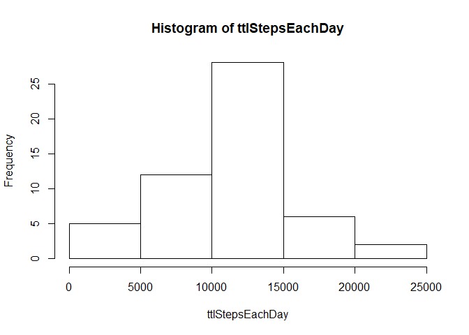
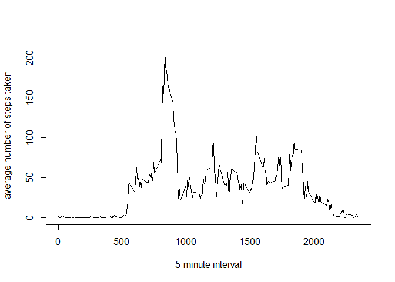
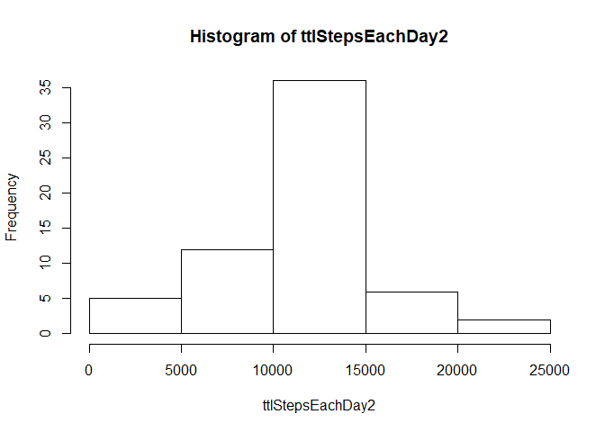
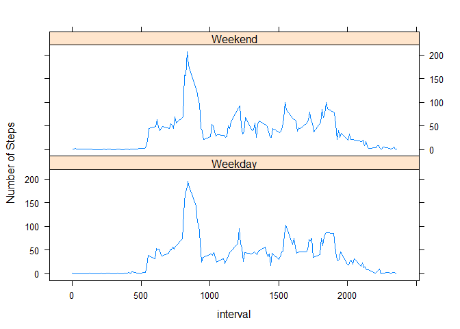

## Loading and preprocessing the data

Show any code that is needed to

1. Load the data

```r
filename <- "activity.zip"
if(!file.exists(filename)){
        fileURL <- "https://d396qusza40orc.cloudfront.net/repdata%2Fdata%2Factivity.zip"
        download.file(fileURL, filename)
}
if(!file.exists("activity.csv")){
        unzip(filename)
}
act <- read.csv("activity.csv")
```
## What is mean total number of steps taken per day?
1. Calculate the total number of steps taken per day


```r
ttlStepsEachDay <- tapply(act$steps, act$date, sum)
```

2. Make a histogram of the total number of steps taken each day

```r
hist(ttlStepsEachDay)
```

<!-- -->

3. Calculate and report the mean and median of the total number of steps 
        taken per day

```r
mean(ttlStepsEachDay, na.rm = TRUE)
```

```
## [1] 10766.19
```

```r
median(ttlStepsEachDay, na.rm = TRUE)
```

```
## [1] 10765
```

## What is the average daily activity pattern?
1. Make a time series plot of the 5-minute interval (x-axis) and the average 
        number of steps taken, averaged across all days (y-axis)


```r
x <- unique(act$interval)
y <- tapply(act$steps, act$interval, mean, na.rm = TRUE)
plot(x,y, type = "l", xlab = "5-minute interval", 
     ylab = "average number of steps taken")
```

<!-- -->

2. Which 5-minute interval, on average across all the days in the dataset, 
        contains the maximum number of steps?


```r
subset(act, steps == max(act$steps, na.rm = TRUE))
```

```
##       steps       date interval
## 16492   806 2012-11-27      615
```

## Imputing missing values
1. Calculate and report the total number of missing values in the dataset 
        (i.e. the total number of rows with NAs).  


```r
table(is.na(act$steps))
```

```
## 
## FALSE  TRUE 
## 15264  2304
```

2.  Devise a strategy for filling in all of the missing values in the dataset. 
        I'll use the mean of the interval which we already have saved as "y"
        
3.  Create a new dataset that is equal to the original dataset but with the 
        missing data filled in.


```r
act2 <- act
for(i in 1:nrow(act2)){
        if(is.na(act2[i,1])){
                act2[i,1] <- y[as.character(act2[i,3])]
        }        
}
```

4.a.  Make a histogram of the total number of steps taken each day and Calculate 
        and report the mean and median total number of steps taken per day.
        

```r
ttlStepsEachDay2 <- tapply(act2$steps, act2$date, sum)
hist(ttlStepsEachDay2)
```

<!-- -->

```r
mean(ttlStepsEachDay2, na.rm = TRUE)
```

```
## [1] 10766.19
```

```r
median(ttlStepsEachDay2, na.rm = TRUE)
```

```
## [1] 10766.19
```
        
4.b. Do these values differ from the estimates from the first part of the 
        assignment?  There appears to be no change
        
4.c. What is the impact of imputing missing data on the 
        estimates of the total daily number of steps?  There doesn't seem to be
        any impact.
        
        
## Are there differences in activity patterns between weekdays and weekends?

```r
library(lubridate)
```

```
## Warning: package 'lubridate' was built under R version 3.3.3
```

```
## 
## Attaching package: 'lubridate'
```

```
## The following object is masked from 'package:base':
## 
##     date
```

```r
dates <- act[,2]
dates2 <- ymd(dates)
dayofweek <- weekdays(dates2)
dayofweek <- gsub("Monday", "Weekday", dayofweek)
dayofweek <- gsub("Tuesday", "Weekday", dayofweek)
dayofweek <- gsub("Wednesday", "Weekday", dayofweek)
dayofweek <- gsub("Thursday", "Weekday", dayofweek)
dayofweek <- gsub("Friday", "Weekday", dayofweek)
dayofweek <- gsub("Saturday", "Weekend", dayofweek)
dayofweek <- gsub("Sunday", "Weekend", dayofweek)
act <- cbind(act, dayofweek)
avgStepsEachDayofWeek <- tapply(act$steps, act$dayofweek, mean, na.rm = TRUE)
xyplot(tapply(act$steps, act$interval, mean, na.rm = TRUE) ~ unique(act$interval) | unique(act$dayofweek), data = act, layout = c(1,2), type = "l", ylab = "Number of Steps", xlab = "interval")
```

<!-- -->
